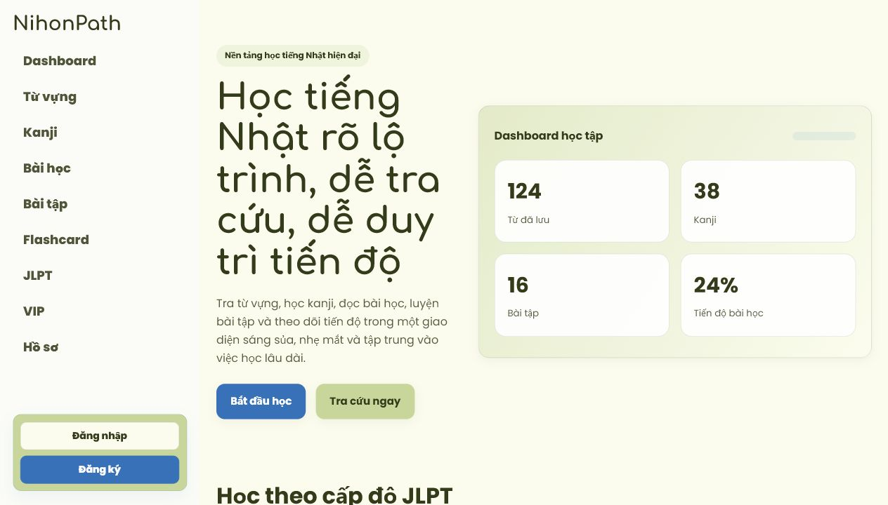
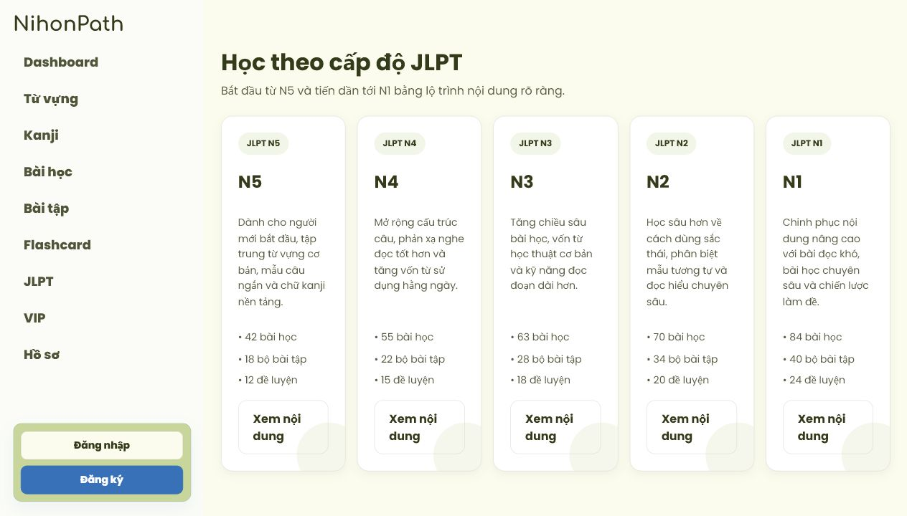

# NihonPath

NihonPath là website học tiếng Nhật với lộ trình JLPT, từ vựng, kanji, bài học, bài tập và flashcard. Giao diện được thiết kế để học nhanh, dễ tra cứu và theo dõi tiến độ.

Website đã deploy: [https://nihonpath-zeta.vercel.app/](https://nihonpath-zeta.vercel.app/)

## Hình ảnh thực tế





## Tính năng chính

- Học theo cấp độ JLPT từ N5 đến N1.
- Tra cứu từ vựng và kanji.
- Xem bài học, luyện bài tập và làm đề JLPT.
- Lưu từ, lưu kanji và theo dõi tiến độ học.
- Tạo và ôn tập flashcard.
- Đăng nhập, đăng ký, hồ sơ người dùng và phân quyền admin.

## Công nghệ sử dụng

- Frontend: React, Vite, React Router.
- Backend: Java 17, Spring Boot, Spring Security, Spring Data JPA.
- Database: MySQL.
- Deploy frontend: Vercel.

## Cấu trúc dự án

```text
japanese-learning/
├── backend/    # API Spring Boot
├── frontend/   # Giao diện React
└── database/   # File database hiện tại
```

## Chạy local

### Frontend

```bash
cd frontend
npm install
npm run dev
```

### Backend

```bash
cd backend
./mvnw spring-boot:run
```

Backend đọc cấu hình qua biến môi trường hoặc file local trong `D:/secrets/`. Không commit mật khẩu, API key hoặc file cấu hình riêng của máy lên repo.

## Ghi chú

Repo này là phiên bản chính hiện tại của dự án NihonPath. Các file build, dependency, upload local và secret đều được bỏ qua bằng `.gitignore`.
